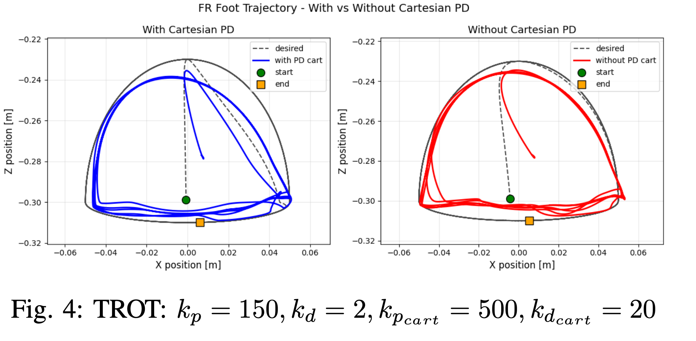

# 🐕 Quadruped Locomotion: CPG & Deep Reinforcement Learning

>**Bridging bio-inspired control with Deep-RL for robust legged locomotion.**

---

## 📌 Project Overview
This project presents a comprehensive study on quadruped locomotion utilizing **Central Pattern Generators (CPG)** and **Deep Reinforcement Learning (DRL)**. I implemented and evaluated multiple gaits—**Trot, Walk, Pace, and Bound**—and analyzed key design choices in observation and action spaces to achieve robust performance in varied conditions, including steep slope traversal.

  
  
  
<em>Left: Quadruped traversing a slope. Right: High-velocity tracking at 1.3 m/s.</em>

---

## 🛠️ Methodology

### 1. Central Pattern Generator (CPG) Formulation
Each leg is modeled using a **Hopf oscillator** in polar form to generate stable limit cycles as rhythmic pattern generators.
* **Dynamics:** Amplitudes ($r_i$) converge to a target magnitude ($\sqrt{\mu}$), and phases ($\theta_i$) are synchronized through an inter-oscillator coupling matrix.
* **Gait Design:** Four essential gaits were implemented (Trot, Walk, Pace, and Bound) by defining specific pairwise phase-lags.

### 2. Deep Reinforcement Learning (DRL)
* **Algorithm:** Utilized **Proximal Policy Optimization (PPO)** due to its superior performance over Soft Actor-Critic (SAC) in this task.
* **Observation Space:** Fused proprioceptive data (joint states, base orientation/velocity, foot contacts) with internal CPG states (amplitude and phase) to provide a structured rhythmic prior.
* **Action Space:** Benchmarked **CPG-based action spaces** (frequency/amplitude) against **Cartesian-space PD controllers**.

---

## 📈 Results & Performance

### Tracking Accuracy
* **Cartesian PD Improvement:** Adding Cartesian-space feedback reduced end-effector tracking RMS error by **8.9%** compared to joint-space control alone.
* **Velocity Tracking:** Achieved precise tracking for 0.5 m/s and 1.0 m/s. Higher speeds (up to 1.53 m/s) were explored by analyzing gait-specific comfort limits.

  

### Robustness & Slope Traversal
* **Curricular Training:** Employed a "warm-start" approach, training first on flat terrain before fine-tuning on slopes.
* **Adaptive Difficulty:** By progressively increasing incline difficulty (**Adaptive Curricular Training**), the agent successfully traversed slopes up to **29%**.

---

## 🔬 Key Discussion Points
* **Action Space Analysis:** While Cartesian policies reached higher rewards, they often exhibited unnatural "reward-hacking." CPG action spaces produced smoother, more physically plausible locomotion .
* **Sim-to-Real Considerations:** Implemented domain randomization—including friction variance and observation noise—to prepare the policy for real-world hardware constraints.

---

## 🚀 Future Extensions
* **Force-Feedback CPGs:** Injecting contact feedback into oscillator dynamics to improve terrain adaptation.
* **Virtual Model Control (VMC):** Adding a VMC layer to regulate trunk objectives (orientation/height) independently of the rhythmic gait.

---

## 📂 Project Structure
* `run_sb3.py`: Training file.
* `load_sb3.py`: Policy loading.
* `envs/`: Pybullet environment definitions.
* `report.pdf`: Full technical documentation.

---

### 🎓 Acknowledgments
Developed as part of the M.Sc. Robotics curriculum at **EPFL**.
* **Collaborators:** Alexandros Dellios, Tom Herrmann, Salah Slaoui Hasnaoui.
* **Supervision:** Lab of Prof. A. Ijspeert (BioRob).
